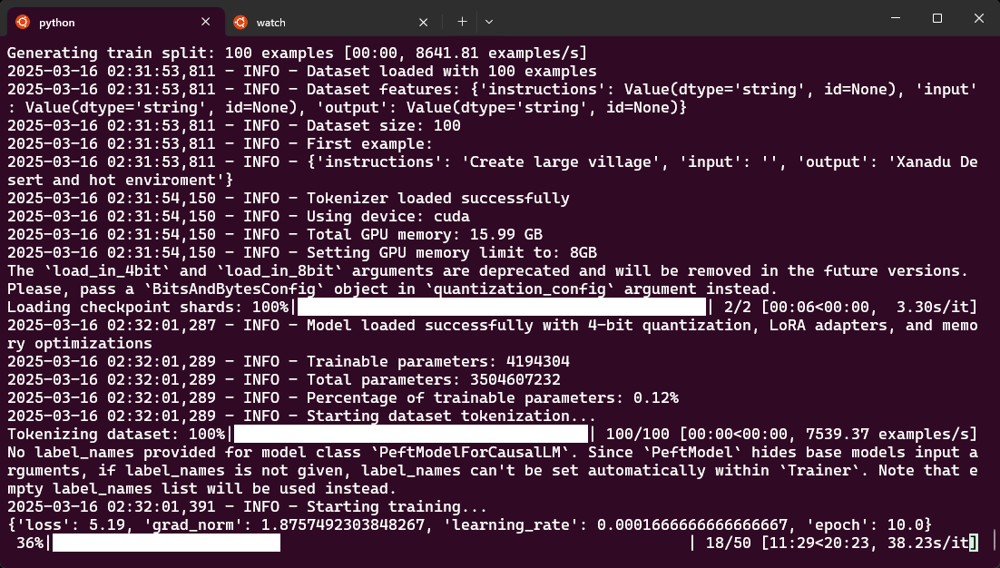
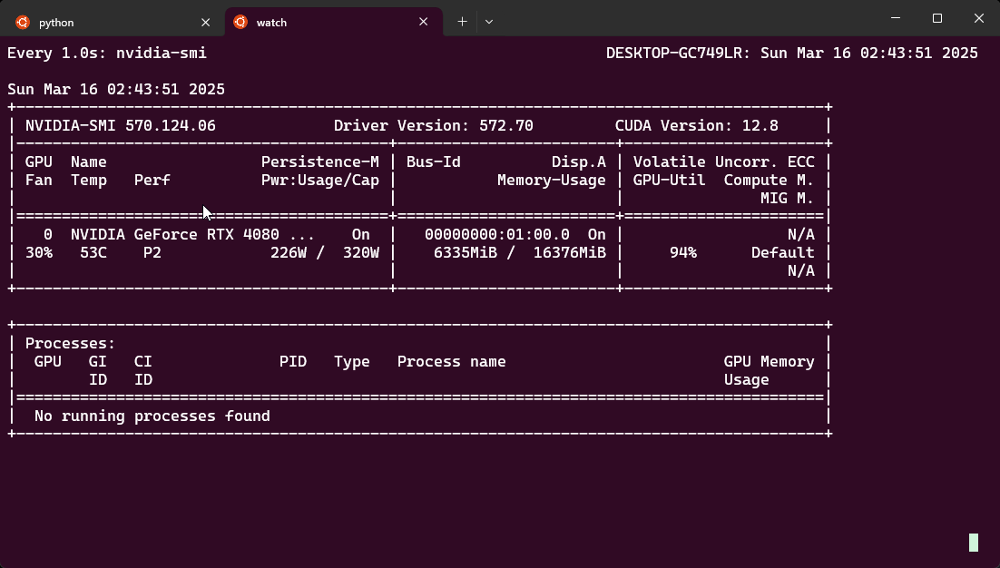

# Testing Lallama 7B Models for general GEN AI

## TODO

file structure and how to install
ssh auto start in vm -.-

## Two point aproach

 - [X] Master prompt template without fine tuning
        - Instruction Prompting: Explicitly separating system instructions, user input, and constraints.
        - Llama-2 Chat Format: Uses [INST] and <<SYS>> tags to denote conversational roles (ref).
 - [X] Fine tuning with with limited data tests
        - Random data can be seen
        - Worked 1 h on 7B params quant 4
        - Terminal outputs:
         
         

- [x] Basic image generation
       - Stable fusion implementation
       - Example outputs:
         

## Compare perfs, quants and check lower models

## Local setup

- 64 GB ram 6 ghz
- 16 GB VRAM - cuda available
- WSL 2
- Ollama
- Hugging face
- python
    - for llm communication
    - data generation
    - data extraction TBD
- TODO :/ create requqiments.txt
- TBD://Copy paste instructions that work

# TODO
 - Understand slop
 - TYPOS
 - short prompts [village,weather,3 words max]
 - API
 - Client
 - Maintainece of requqiments.txt
 - check meta access of lama models for chat
